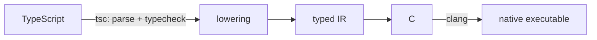

# scriptc

**Zero-runtime TypeScript.** scriptc compiles ordinary TypeScript into small, fast native executables — no Node, no V8, no JavaScript engine in the binary.

```console
$ cat fib.ts
function fib(n: number): number {
  return n < 2 ? n : fib(n - 1) + fib(n - 2);
}
console.log(fib(30));

$ scriptc run fib.ts
832040

$ scriptc build fib.ts && ls -la fib
-rwxr-xr-x  178K  fib        # a self-contained native binary, ~2ms startup
```

No changes to your code. No annotations, no dialect — the same TypeScript you run on Node, type-checked by the real TypeScript compiler and compiled to native. What compiles behaves byte-for-byte like Node.

## Install

This is a fork of [`vercel-labs/scriptc`](https://github.com/vercel-labs/scriptc) and publishes its own packages under its own scope:

```console
$ npm install -g @scriptc-fork/scriptc
```

The installed command is still `scriptc`. Upstream's `npm install -g scriptc` is a **different** compiler that does not carry this fork's work — see [RELEASING.md](RELEASING.md) for what this repository publishes and why the packages were renamed.

To work from a clone instead, which is also what contributors do:

```console
$ git clone https://github.com/vinikjkkj/scriptc && cd scriptc
$ pnpm install && pnpm build
$ pnpm scriptc build fib.ts      # or: node packages/cli/dist/main.js build fib.ts
```

Requires a C compiler. Plain `clang` is the default (preinstalled with Xcode Command Line Tools). Where there is no clang, set `SCRIPTC_CC=zigcc` and the driver becomes `zig cc`; cross-target builds (`SCRIPTC_TARGET=<triple>`) require `zigcc`, because the default clang path has no cross-target sysroots. macOS arm64 is the primary platform; Linux and Windows binaries build by cross-compilation, each verified by its own differential test lane.

## The idea: staticness you can see

Most TypeScript is far more static than the ecosystem assumes. scriptc decides, construct by construct, what can compile to native code — and tells you:

```console
$ scriptc coverage app.ts

  statements analyzed   4481
  compile statically    4451  (99%)

  blockers:
      ×2  functions with optional parameters as values   SC1090
      ×1  Promise.reject                                 SC2020
```

Three tiers, always explicit:

1. **Compiled statically** — native code, no engine. The default, and the only mode unless you opt out.
2. **Runs dynamically** (`--dynamic`) — an embedded JavaScript engine ([quickjs-ng](https://github.com/quickjs-ng/quickjs), ~620KB) executes what can't be static: npm dependencies' shipped JS, `any`-typed code. Every value crossing back into static code is validated at runtime — a lying type throws a catchable `TypeError` instead of corrupting memory.
3. **Rejected** — everything else fails with a specific error code, a code frame, and usually a rewrite hint. Nothing is ever silently miscompiled.

## What compiles

The static surface covers the language and the standard library real programs use:

- **The language** — classes with single inheritance and true dynamic dispatch (devirtualized when provably safe), closures with JS capture semantics, generics (monomorphized), discriminated unions as tagged values driven by TypeScript's own narrowing, `async`/`await` on stackful fibers with JS-exact scheduling, exceptions with `finally`, destructuring, spread, optional/default/rest parameters, getters/setters, iterators over strings/arrays/Maps/Sets, template literals, regular expressions (the engine is the same ECMAScript-exact bytecode interpreter QuickJS uses, linked only into regex-using binaries).
- **The standard library** — strings with UTF-16-exact semantics, arrays/Maps/Sets with JS-exact ordering and identity, `JSON` with runtime-validated casts, `Math`, typed arrays and `Buffer`, `Error` hierarchies with typed `catch`.
- **Node's API surface** — `fs` (sync and promises), `path` (byte-exact port), `process`, `child_process` with piped streams, `os`, `crypto`, `url`/`URL`, `zlib`, timers and signal handlers on a dependency-free event loop — and the server stack: **`net`, `http`, `https`, `tls`** (vendored mbedTLS), `dgram`, `dns`, `fs.watch`, `readline`. Real proxy servers compile.
- **`fetch`** and the WHATWG web subset (streams, `Headers`, `AbortSignal`) over the same native net/TLS stack — redirects, gzip, `AbortSignal.timeout`, Node-shaped error causes; no libcurl, no system HTTP dependency.
- **npm dependencies** (with `--dynamic`) — packages resolve with Node's own algorithm, typecheck against their shipped `.d.ts`, and their JS is embedded into the binary at build time. Binaries never read `node_modules` at runtime.

Programs typecheck against TypeScript's real `es2025` lib (plus `@types/node` when your project has it), and your `tsconfig.json` governs checker strictness. Anything reached that has no lowering is a precise diagnostic, never a surprise.

## Correctness

Two enforcement mechanisms run on every change:

- **Differential testing** — every corpus program (800+ tests) runs under Node *and* as a native binary; stdout, stderr, and exit codes must match byte-for-byte. Number formatting is JS-exact (shortest-roundtrip, fuzz-verified against Node on a million doubles). Servers are tested with live client drivers against both implementations.
- **Memory-safety lane** — the entire corpus re-runs under AddressSanitizer with a reference-count audit; leaks and use-after-free are build failures.

The deliberate divergences from Node (there are a few dozen, mostly around timing internals and error-object properties) are documented and numbered; nothing diverges silently.

## Performance

Measured on Apple M-series against the same workloads in Node, Go, Rust, and Zig (all byte-identical output, verified):

| dimension | scriptc | context |
|---|---|---|
| startup | ~2.4ms | Node: ~47ms; on par with Zig, ahead of Go/Rust |
| binary size | 170–200KB static, ~3MB with `--dynamic` + embedded deps | Go: ~2MB; Node SEA: 60–100MB |
| memory (RSS) | 1–4MB typical | Node: 67–116MB |
| runtime | JS-faithful f64 semantics; competitive with the systems languages on most workloads | integer inference and ownership analysis are on the roadmap |

## Escape hatches

- **`comptime(() => ...)`** runs TypeScript at build time (in an isolated VM inside the compiler) and bakes the result into the binary as a literal.
- **Native FFI (`--ffi`)** binds signature-only TypeScript declarations to direct C ABI calls and links manifest-declared archives, objects, and system libraries. The boundary is explicit and length-delimited; see the [Native FFI guide](https://scriptc.dev/ffi).
- **`--dynamic`** embeds the engine for npm deps and `any` code. `scriptc coverage --dynamic` reports exactly which statements run where and what the remaining blockers are. Static stays the default: a binary never silently grows an engine.
- **Checked casts** — `JSON.parse(...) as Config` inserts a runtime validation that throws a catchable error naming the offending path (`expected number at $.port, got string`). TypeScript's `as` is a promise; scriptc verifies it.

## Architecture



- `packages/compiler` — frontend (tsc API → IR), the IR with validator/serializer, the LLVM and C backends. The IR is the only interface between the ends; LLVM is the default code generator (with a transparent fallback for programs outside its tier), and C is the reference backend forever (readable, source-line-annotated output via `--backend c`).
- `packages/runtime` — the C runtime: refcounted values with a cycle collector, stackful fibers and the event loop (kqueue), the server stack, JS-exact number formatting. Feature units are link-gated: binaries pay only for what they use.
- `packages/cli` — `scriptc build | run | coverage`.

## Development

```console
$ pnpm install && pnpm build
$ pnpm test                      # differential corpus + diagnostics snapshots
$ SCRIPTC_SAN=1 pnpm test        # the same corpus under ASan + RC audit
$ export SCRIPTC_SANDBOX_IMAGE=vcr.vercel.com/your-team/your-project/sandbox-tests:node24
$ pnpm test:sandbox:image        # build + publish the custom Sandbox image
$ pnpm test:sandbox              # fast Pro+ gate: 16 concurrent 8-vCPU Sandboxes
$ SCRIPTC_SANDBOX_VCPUS=4 pnpm test:sandbox --shards 4
                                  # Hobby gate: same coverage, 8 concurrent Sandboxes
$ pnpm scriptc build x.ts --emit-ir   # keep .scriptc/x.c and x.ir.json
```

The hybrid sandbox runner uploads the exact dirty worktree and case-shards the
corpus-heavy harnesses across eight 8-vCPU sandboxes per lane. Portable test
files are file-sharded over the same Sandboxes. Files whose behavior cannot
change under `SCRIPTC_SAN` run once; sanitizer-aware files and the differential
corpus still run in both lanes. Full portable behavior runs on Linux. On
macOS, compact host contracts retain the native ABI, Mach-O size, linker,
libc, kqueue network/dgram/watch/child/stdin behavior, and Apple-ASan checks
that can genuinely differ there. Linux contributors run the supported native
clang contracts locally; other hosts retain that coverage in the Sandboxes.
Before extraction, each Sandbox clears image-seeded workspace files while
retaining its dependency cache, so local deletions and renames cannot reappear
from the image.
Acceptance suites whose oracle lives in an external worktree run locally;
case-addressable suites are sharded there. No assertion or sanitizer coverage
is dropped.
Disposable sandboxes are removed when the run finishes. The remote sanitized
lane disables Linux LeakSanitizer to match Apple ASan; ASan memory-safety
checks and scriptc's RC audit remain enabled. Authenticate with Vercel, choose
a Vercel project you control, and set `SCRIPTC_SANDBOX_IMAGE` to a fully
qualified image in that project's Vercel Container Registry. The fast default
requires a Pro or Enterprise project because it allocates 16 concurrent 8-vCPU
Sandboxes. Hobby projects use the 4-shard, 4-vCPU command above; it retains the
same assertions and sanitizer coverage with lower parallelism. `pnpm install`
provides the repository's pinned Vercel CLI, so no global CLI is required. Both
sandbox commands load `.env.local` when it exists, including the
`VERCEL_OIDC_TOKEN` written by `vercel env pull`; variables exported by the
agent or shell take precedence. Re-run
`pnpm test:sandbox:image` when the Dockerfile's Node, pnpm, or system
dependencies change.

Every feature lands with differential tests; both lanes green is the merge bar.
